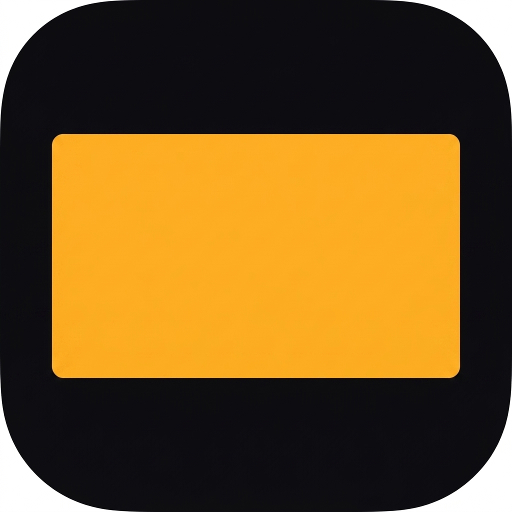

<div align="center">


# Focus

**Make your big monitor smaller.**

A tiny macOS menu-bar app that frames your display in black and keeps your windows
inside it — so a 32″ panel works like a 27″ one.

</div>

---

## Why

A 32″ monitor is a lot of neck travel and a lot of peripheral distraction. Focus paints a
black border around a centred working area and confines your windows to it, so you get the
calm of a smaller screen without buying one.

```
┌──────────────────────────────────────────────┐ 2560 × 1440
│▓▓▓▓▓▓▓▓▓▓▓▓▓▓▓▓▓▓▓▓▓▓▓▓▓▓▓▓▓▓▓▓▓▓▓▓▓▓▓▓▓▓▓▓▓▓│
│▓▓▓▓┌────────────────────────────────────┐▓▓▓▓│
│▓▓▓▓│                                    │▓▓▓▓│
│▓▓▓▓│            2180 × 1226             │▓▓▓▓│   27″ of a 31.7″ panel
│▓▓▓▓│                                    │▓▓▓▓│
│▓▓▓▓└────────────────────────────────────┘▓▓▓▓│
│▓▓▓▓▓▓▓▓▓▓▓▓▓▓▓▓▓▓▓▓▓▓▓▓▓▓▓▓▓▓▓▓▓▓▓▓▓▓▓▓▓▓▓▓▓▓│
└──────────────────────────────────────────────┘
```

## What it does

- **Black frame** around a centred working area, sized by the diagonal you pick.
- **Window clamping** — windows that stray into the border snap back inside on mouse-up,
  and the green zoom button maximises to the working area instead of the whole panel.
- **Menu bar hiding** — the frame covers the menu bar and reveals it when you push the
  pointer to the top edge.
- **Standard sizes only** — 20″ / 22″ / 24″ / 27″ / 30″ buttons, filtered to those smaller
  than your actual panel. No fiddly slider.
- **Global shortcut** — <kbd>⌃</kbd><kbd>⌥</kbd><kbd>⌘</kbd><kbd>F</kbd> toggles it,
  rebindable from the menu.
- **Panel size auto-detected** from the display's EDID, overridable if it lies.

## Install

1. Download `Focus.zip` from the [latest release](../../releases/latest) and unzip it.
2. Drag **Focus.app** to your **Applications** folder.
3. **First launch:** right-click the app → **Open** → **Open**.

   Focus is signed with a Developer ID certificate but is *not notarised*, so double-clicking
   it the first time gives you "Apple could not verify…". Right-click → Open is the
   supported way past that. You only need to do it once.

   If macOS still refuses:
   ```bash
   xattr -dr com.apple.quarantine /Applications/Focus.app
   ```
4. **Grant Accessibility.** Focus will prompt on first launch. Go to
   **System Settings → Privacy & Security → Accessibility** and enable **Focus**.

   This is what lets it move windows. Without it you still get the black frame, but windows
   won't be confined to it.

Then click the menu-bar icon and hit **Shrink Display**.

## Usage

| | |
|---|---|
| <kbd>⌃</kbd><kbd>⌥</kbd><kbd>⌘</kbd><kbd>F</kbd> | Toggle on/off |
| Menu → **Make my screen feel like** | Pick the target size |
| Menu → **Frame Covers Windows** | Frame masks windows, or just dresses the wallpaper |
| Menu → **Hide Menu Bar While Shrunk** | Cover the menu bar, reveal on hover |
| Menu → **Change Shortcut…** | Press any combination to rebind |
| Menu → **Panel size** | Override the detected diagonal if it's wrong |
| Menu → **Copy Debug Info** | Paste this into a bug report |

## How it works

macOS has **no public API to shrink a screen's usable area**. `NSScreen.visibleFrame` is
owned by the WindowServer, and only the menu bar and the Dock get to reserve space in it.
Focus therefore does two cooperating things:

1. A borderless, click-through window per screen paints the black bars. Its window level
   decides whether it sits above app windows (masking them) or on the wallpaper.
2. The Accessibility API watches every app's windows and clamps any that stray outside the
   working area — debounced so it never fights a live drag.

The geometry is pure and unit-tested: `targetDiagonal / panelDiagonal` gives a linear
scale, applied to the screen frame and centred.

### Known limits

- **Native fullscreen** (<kbd>⌃</kbd><kbd>⌘</kbd><kbd>F</kbd>) can't be constrained — the
  app takes the whole panel. Use the green zoom button instead.
- **The menu bar can't be moved or narrowed**, only hidden. Its geometry comes from the
  display bounds, which no app controls.
- **Black is only as black as your panel.** On an LCD the backlight is always on, so the
  bars are dark grey at roughly 1000:1. Focus already outputs `#000000`; there is nothing
  below zero. Ambient light and monitor brightness matter far more than any software knob.
- Only the primary display is framed.

## Build from source

Requires Xcode 26+ and [XcodeGen](https://github.com/yonaskolb/XcodeGen)
(`brew install xcodegen`). The `.xcodeproj` is generated — `project.yml` is the source of
truth.

```bash
git clone https://github.com/voising/focus.git
cd focus
xcodegen generate

xcodebuild test  -scheme Focus -destination 'platform=macOS'
xcodebuild       -scheme Focus -configuration Release -destination 'platform=macOS' build
```

Set `DEVELOPMENT_TEAM` in `project.yml` to your own team, or switch
`CODE_SIGN_IDENTITY` to `"-"` for a local ad-hoc build. Note that an ad-hoc signature
changes on every build, so macOS will drop the Accessibility grant each time — use a real
certificate if you're iterating.

The app icon is generated art; `scripts/make_appicon.py` re-masks it and emits the
asset catalog.

## Licence

MIT — see [LICENSE](LICENSE).
